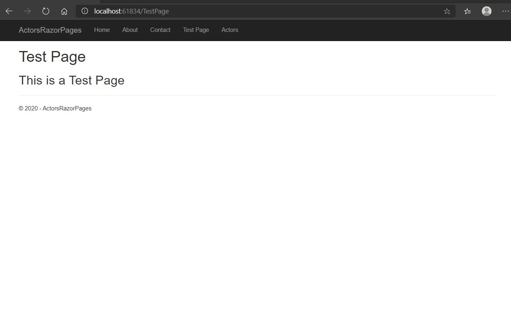
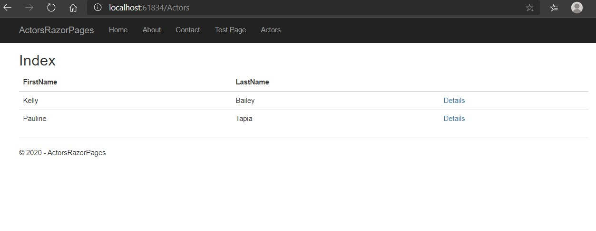
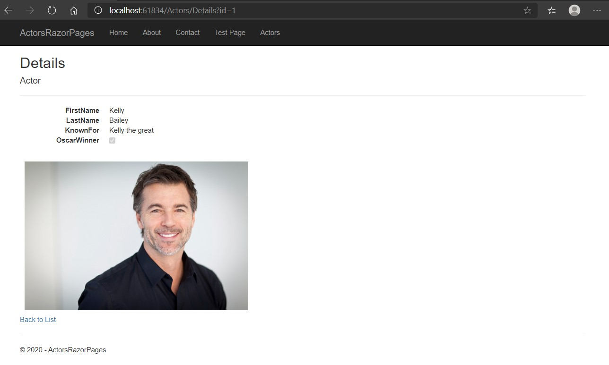

# Module 1: Exploring ASP.NET Core MVC

## Lab: Exploring ASP.NET Core MVC 

1. **Nombres y apellidos:** Francisco Javier Moreno Quevedo
2. **Fecha:** 06/12/2020
3. **Resumen del Ejercicio:**  Crear un proyecto Net core Web App comprenderlo y añadir una funcionalidad
4. **Dificultad o problemas presentados y como se resolvieron:** Ninguna


- Ejercicio 1: Exploring a Razor Pages Application

  - Creamos un nuevo proyecto **ASP.NET Core Web Application**
  - Añadimos la pagina Razor **TestPage.cshtml**
- En el **TestPage.cshtml** añadimos el siguiente codigo
  
  ```cs
     @{
          ViewData["Title"] = "Test Page";
         }
  
         <h1>@ViewData["Title"]</h1>
         <h2>This is a Test Page</h2>
  ```

- Añadimos en _Layout.cshtml la entrada de menu a la pagina de testpage.cshtml


 ```<li><a asp-page="/TestPage">Test Page</a></li>
	<li><a asp-page="/TestPage">Test Page</a></li>
 ```

- Creamos dentro de la carpeta Models la clase **Actor** y le añadimos sus propiedades

- Creamos el interface **IData** lo hacemos publico y añadimos:

  ```cs
      List<Actor> ActorsList { get; set; }
         List<Actor> ActorsInitializeData();
         Actor GetActorById(int? id);
  ```

- Agregamos la clase **Data**

- Agregamos las imagenes existentes de actores

- Creamos la carpeta Actors bajo Pages que contendra las vistas de la clase actor

- Añadimos bajo esa carpeta la vista index.cshtml

  - Añadimos en su codigo Behind la implementación del interface Idata
  - Añadimos en el codigo de la pagina el codigo que mostrara los actores
  
- Añadimos la pagina de Details.cs y Details.cshtml  de los actores

- En el middleware inyectamos la dependencia de IData

- Añadimos una entrada en el _Layout.cshtml al menu de actores

- Ejecutamos:

  





